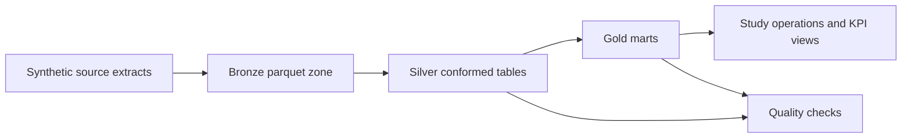

# Clinical Trial Lakehouse Observatory

Local-first lakehouse project that models a regulated clinical-trial analytics platform using synthetic source data, bronze and silver conformance, and gold marts for operations and BI.

## Why this repo matters

This project is meant to look like the public version of enterprise work I have done in regulated environments:

- governed data platform design
- bronze, silver, and gold modeling
- quality checks as part of the pipeline, not an afterthought
- analytics-ready marts for study operations and risk monitoring
- production-minded project structure instead of notebook-only code

## Architecture



## Data domains

| Domain | Description |
| --- | --- |
| `participants` | Enrolled trial participants by site and study |
| `visits` | Visit cadence, completion status, and scheduling patterns |
| `labs` | Common biomarker observations attached to visits |
| `adverse_events` | Safety event records with severity and outcome |

## Gold outputs

| Table | Purpose |
| --- | --- |
| `gold_enrollment_site_summary` | Enrollment, active, and completed counts by site and study |
| `gold_patient_risk_monitor` | Participant-level risk queue using lab and adverse-event signals |
| `gold_study_kpis` | Study-level operating metrics for reporting and monitoring |

## Verified run

The pipeline was run successfully and produced:

- `gold_enrollment_site_summary`: 6 rows
- `gold_patient_risk_monitor`: 240 rows
- `gold_study_kpis`: 2 rows
- quality checks: passed
- tests: `1 passed`

Example query output:

```text
Study KPIs
STUDY_101  Oncology    high_risk_participants=62  medium_risk_participants=44
STUDY_202  Immunology  high_risk_participants=60  medium_risk_participants=40
```

## Quick start

```bash
python3 -m venv .venv
.venv/bin/python -m pip install -r requirements.txt
.venv/bin/python scripts/run_pipeline.py
.venv/bin/python scripts/query_gold.py
.venv/bin/pytest
```

## Repo layout

```text
clinical-trial-lakehouse-observatory/
├── docs/
├── scripts/
├── src/ctlo/
├── tests/
├── data/raw/
└── warehouse/
```

## Design choices

- DuckDB and Parquet keep the project local and easy to demo while preserving a SQL-first lakehouse feel.
- Synthetic clinical data avoids proprietary risk while keeping the domain and modeling realistic.
- Risk scoring is deliberately simple and explainable so it reads like operational analytics, not black-box ML.
